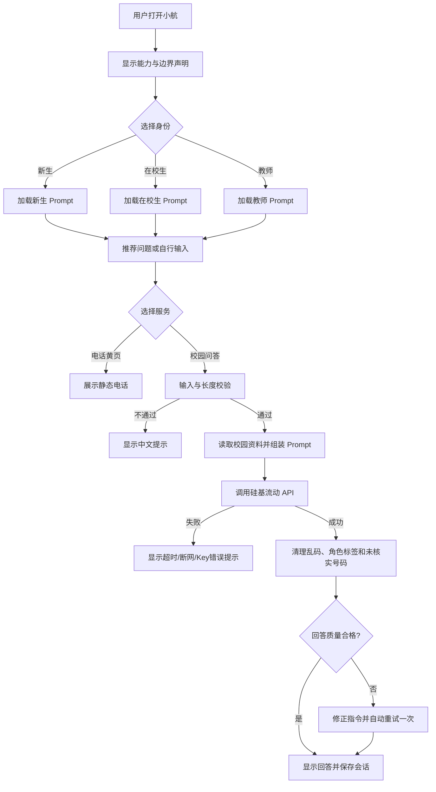

# “小航”郑州航院校园信息助手需求分析文档

## 一、项目概述

### 1.1 项目背景

新生、在校生和教师在校园生活中经常需要查询报到材料、宿舍入住、办事流程、交通路线、常用电话和应急求助方式。传统信息分散在通知、手册和网页中，用户需要反复搜索；通用大模型虽然能够回答自然语言问题，但不了解学校内部最新资料，可能编造电话号码、地址或办理流程。

本项目拟开发“校园信息助手小航”，通过“Prompt 工程 + 硅基流动大模型 API + 本地 Markdown 校园资料”提供校园咨询服务。系统不依赖复杂框架，将需求分析、资料质量、身份分流和防幻觉规则作为核心。

### 1.2 项目目标

1. 为新生、在校生和教师提供清晰、可执行的校园信息查询服务。
2. 根据用户身份切换不同语气、信息重点和回答结构。
3. 通过推荐问题降低使用门槛，通过电话黄页保证 API 不可用时仍有基本服务。
4. 仅依据本地校园资料回答，减少电话、地址、金额和政策编造。
5. 形成可运行、可演示、可测试、可通过 Git 管理的 Streamlit 项目。

### 1.3 技术栈

- 开发语言：Python。
- 页面框架：Streamlit。
- 大模型服务：硅基流动 API。
- 使用模型：`zai-org/GLM-5.2`。
- 校园数据：Markdown 文件。
- 网络请求：`requests`。
- 测试工具：`unittest`、Mock。
- 版本管理：Git、GitHub。

### 1.4 设计原则

- 用户、场景、功能三要素先行，再进行编码。
- 新生优先，同时兼顾在校生和教师。
- 电话、金额、地址、时间和政策必须以学校最新官方信息为准。
- API 能力与静态信息相结合，关键电话不能完全依赖 AI。
- 功能具体、可验证，避免无边界扩展。

## 二、用户分析

### 2.1 用户类型与需求

| 用户类型 | 用户特点 | 典型使用场景 | 4 个高频问题 | 对应功能 | 优先级 |
|---|---|---|---|---|---|
| 大一新生 | 对校园不熟悉，信息焦虑，容易遗漏材料或遭遇诈骗 | 入学报到、宿舍入住、交通出行、校园卡使用 | ① 新生报到需要准备哪些材料？ ② 宿舍入住要注意什么？ ③ 校园一卡通丢了怎么办？ ④ 怎么去学校？ | 校园问答、身份选择、推荐问题、电话黄页 | 高 |
| 在校生 | 已熟悉校园环境，但办事频繁，重视效率 | 开具证明、宿舍调整、户口迁移、后勤报修 | ① 如何申请在读证明？ ② 如何办理宿舍调整？ ③ 户口迁移怎么办理？ ④ 后勤报修电话是多少？ | 校园问答、推荐问题、电话黄页 | 中 |
| 教师 | 需要正式、可靠的信息，关注部门、依据和联系方式 | 教学保障、行政办事、设备报修、应急联系 | ① 教师办理校园事务应联系哪个部门？ ② 教室设备出现故障找谁报修？ ③ 校园应急和值班电话有哪些？ ④ 校区交通和校车信息怎么查询？ | 校园问答、身份选择、电话黄页 | 中 |

### 2.2 需求差异

- 新生需要亲切、详细、通俗的步骤说明，并增加防骗和材料核对提醒。
- 在校生需要直接结论，优先获得地点、材料、步骤、电话和注意事项。
- 教师需要专业、正式的表达，优先获得办理部门、政策依据、材料和流程；资料没有收录依据时必须明确说明。

### 2.3 特殊场景

- API 超时、断网或额度不足时，系统应给出友好提示，电话黄页仍可使用。
- 用户询问个人成绩、课表、余额或账单时，系统应说明未接入学校个人系统。
- 用户涉及转账时必须进行防骗提醒；涉及自伤、自杀等心理危机时应优先提供安全求助信息。

## 三、功能需求

### 3.1 P0-1 校园问答

| 项目 | 内容 |
|---|---|
| 功能描述 | 用户输入自然语言问题，系统将身份 Prompt、本地校园资料、历史上下文和本轮问题发送给大模型，展示清洗后的回答。 |
| 设计理由 | 校园问答是项目核心，解决信息分散和关键词搜索困难的问题。 |
| 输入 | 用户身份、问题文本、同身份近期会话。 |
| 输出 | 基于校园资料的中文回答、回答字数和 API 耗时。 |
| 验收标准 | 空输入不发送；问题最长 2000 字符；资料未收录时明确说明；不得展示内部角色标签、乱码、虚构电话或资料文件名。 |

### 3.2 P0-2 身份选择

| 项目 | 内容 |
|---|---|
| 功能描述 | 用户可选择“新生、在校生、教师”，系统加载对应身份 Prompt 和回答格式。 |
| 设计理由 | 三类用户关心的信息和表达习惯不同，身份分流能明显提升回答针对性。 |
| 验收标准 | 新生回答包含分步引导和“新生提醒”；在校生以“直接结论”和办事清单为主；教师回答突出部门、依据、材料和流程。 |

### 3.3 P0-3 推荐问题

| 项目 | 内容 |
|---|---|
| 功能描述 | 页面提供 12 个高频问题，每类用户需求覆盖 4 个，点击后自动填入问题。 |
| 设计理由 | 降低首次使用门槛，让用户快速了解系统能够回答的范围。 |
| 验收标准 | 共 12 个问题；问题口语化；能够覆盖新生指南、办事流程、交通、电话和应急防骗资料；至少包含防骗或危机测试问题。 |

### 3.4 P0-4 电话黄页静态页

| 项目 | 内容 |
|---|---|
| 功能描述 | 展示学校总值班室、保卫处、后勤、校医院、招生、火警、急救和心理援助等常用电话。 |
| 设计理由 | 电话属于高风险信息，且 API 可能超时或不可用，因此必须提供不依赖 AI 的静态兜底页面。 |
| 验收标准 | 不配置 API Key 或网络断开时仍可查看；已核验号码准确展示；未核实号码不得编造。 |

### 3.5 进阶功能（后续开发已实现）

| 编号 | 功能 | 说明 |
|---|---|---|
| P1-1 | 多轮对话 | 仅携带当前身份最近 4 轮历史，支持上下文追问。 |
| P1-2 | 会话管理 | 保存问答记录，支持新对话和 TXT 导出。 |
| P1-3 | 回答质量控制 | 清除来源文件名、异常角色标签、乱码和未核实电话；异常回答自动重试一次。 |
| P1-4 | 页面优化 | 工业信息终端风格，主要功能集中在首屏，次要功能折叠收纳。 |
| P1-5 | 自动化测试 | 覆盖 Prompt、API、输入边界、会话、回答清洗和页面辅助功能。 |

## 四、应用流程

### 4.1 主流程描述

1. 用户打开“小航”，查看系统能力与边界声明。
2. 用户选择新生、在校生或教师身份，系统加载对应 Prompt。
3. 用户点击推荐问题或自行输入问题。
4. 系统检查空输入和字符长度，并读取校园 Markdown 资料。
5. 系统组合身份规则、别名词典、防幻觉规则、同身份历史和本轮问题。
6. 系统调用硅基流动 API，检查状态码并解析回答。
7. 系统清理内部角色标记、异常字符、资料文件名和未核实电话。
8. 如果回答出现乱码、角色泄露或明显未完成内容，自动重新请求一次。
9. 页面显示最终回答，将本轮问答保存到会话历史。
10. 用户也可以直接打开静态电话黄页，不调用 API。

### 4.2 流程图

### 4.3 关键设计理由

- 电话黄页必须是 P0，因为它在 API 不可用时仍能提供关键联系方式。
- 不做用户登录，因为项目不查询个人数据，也不应保存账号和密码。
- 身份先行能够决定 Prompt、回答结构和历史上下文，避免不同身份信息互相干扰。

## 五、数据设计

### 5.1 数据格式选型

项目选择 Markdown 存储校园资料。Markdown 便于人工维护，能够用标题分层，大模型可以直接理解，读取后可拼接进 System Prompt；相比 JSON，编辑时不需要处理复杂符号；相比 CSV，更适合保存有层级的长文本。当前阶段不使用数据库和向量库。

### 5.2 数据文件清单

| 文件 | 内容范围 | 主要用户 | 级别 |
|---|---|---|---|
| `data/01_新生入学.md` | 报到、宿舍、校园一卡通等 | 新生 | 课件必做 |
| `data/02_办事流程.md` | 在校生办事、宿舍调整、证明及教师常用流程 | 在校生、教师 | 课件必做 |
| `data/03_电话黄页.md` | 应急、行政、后勤和服务电话 | 全体用户 | 课件必做、静态兜底 |
| `data/04_应急防骗.md` | 校园安全、防骗、火灾和心理危机求助 | 全体用户 | 课件必做 |
| `data/05_交通出行.md` | 校址、地铁、公交、校车和出行提醒 | 新生、访校人员 | 项目扩展 |

### 5.3 Markdown 写作规范

1. 每个文件开头写明维护人、更新日期和数据来源。
2. 一级标题只用于文件主题，使用 `##` 切分主题，使用 `###` 切分小主题。
3. 电话、金额、地址、时间等易变化字段在行末标注“⚠ 以官方为准”。
4. 尚未核验的字段使用“✏ 待核实”，严禁使用猜测值填充。
5. 课件建议每个核心文件 1500～3000 字，4 个核心文件合计约 1 万字；扩充内容前必须先核验准确性。

### 5.4 数据质量要求

- 校园报警电话 `0371-61916110` 和学校总值班室 `0371-61911000` 必须准确。
- 数据加载统一使用 UTF-8 编码。
- 电话、金额、时间和政策信息提交前应对照学校官网或最新通知复核。
- 资料不存在时程序应给出缺失提示，不得静默跳过后继续生成肯定回答。

## 六、Prompt 设计

### 6.1 身份分流策略

| 身份 | 角色定位 | 语气与格式 | 回答重点 |
|---|---|---|---|
| 新生 | 耐心、热情的学长学姐 | 使用“同学你好”；通俗解释；按步骤讲解；结尾增加“新生提醒” | 流程、材料、地点、防骗和容易遗漏的事项 |
| 在校生 | 熟悉校园办事流程的事务助手 | 不寒暄；第一行给“直接结论”；控制在 3～5 点 | 办理地点、所需材料、操作步骤、电话和注意事项 |
| 教师 | 面向教职工的校务信息助手 | 使用“老师您好”；语言专业正式；结尾提示正式核实 | 办理部门、政策依据、办理材料、办理流程和联系方式 |

三套 Prompt 共用相同的校园资料、别名词典和安全规则，差异主要体现在称呼、表达长度、信息排序和结尾提示。

### 6.2 别名词典（不少于 7 组）

| 口语别名 | 标准名称 |
|---|---|
| 学校、航院、郑航、ZUA | 郑州航空工业管理学院 |
| 新校区、龙湖、新校 | 龙子湖校区 |
| 卡、饭卡、校卡 | 校园一卡通 |
| 保安、门卫、校警 | 保卫处 |
| 迁户口、落户 | 户籍迁入或迁出 |
| 调宿舍、换宿舍 | 宿舍调整申请 |
| 证明、在读证明 | 在校学籍证明 |

### 6.3 防幻觉硬规则（核心 6 条）

1. 只能依据校园资料回答；资料没有收录时必须明确说明“不确定/未收录”，建议联系学校总值班室核实。
2. 严禁编造电话号码、地址、办公时间、费用金额、人名和政策。
3. 涉及金钱或转账时，必须提醒用户先联系辅导员核实，陌生人要求私下转账可能是诈骗。
4. 涉及自杀、自伤或“不想活”等心理危机时，优先劝用户远离危险、联系身边可信任的人，并提供心理援助、辅导员、110 或 120 等求助方式。
5. 系统不接入教务、一卡通、财务等个人系统；用户要求查询成绩、课表、余额或账单时必须说明无法查询。
6. 回答必须能够追溯到本地资料。根据后续页面优化要求，不向用户展示内部 `.md` 文件名；资料不足时直接说明并提供官方核实渠道。

### 6.4 补充输出约束

- 历史消息只用于理解追问，始终回答最后一条用户问题。
- 不输出 `user`、`assistant`、`system` 或数字加角色名等内部格式。
- 列举材料、路线或步骤时必须给出实际条目，不能只写引导句后结束。
- 电话只能逐字引用已核验资料；无法核实的号码应隐藏。

## 七、用户边界声明

### 7.1 能聊什么

- 新生入学：报到建议、宿舍入住、校园一卡通和到校交通。
- 办事流程：证明、宿舍调整、户籍、后勤报修等资料中已收录内容。
- 电话黄页：学校值班、校园报警、后勤、校医院、招生和公共应急电话。
- 应急防骗：转账诈骗、火灾、医疗急症和心理危机求助。
- 校园交通：校址、地铁、公交及一般出行提醒。

### 7.2 不能聊什么

- 不能查询个人成绩、课表、校园卡余额、账单或个人档案。
- 不能登录或代替用户操作教务、财务、一卡通等学校系统。
- 不能编造未收录的电话、地址、金额、办公时间、政策和人员信息。
- 不能替用户作出医疗、法律、财务或其他重要决定。
- 不能保证资料实时有效，易变化信息必须以官方最新通知为准。

### 7.3 首页边界声明文字

> **小航能回答：** 新生入学、校园办事、电话黄页、应急防骗和交通出行等本地资料中已收录的信息。  
> **小航不能查询：** 个人成绩、课表、校园卡余额、账单和其他需要登录学校系统的信息。  
> **数据更新日期：** 2026-07-17。电话、金额、地址、时间和政策如有变化，请以学校官网、最新通知或相关部门答复为准。

## 八、不做的事

| 不做的内容 | 理由 |
|---|---|
| 不引入向量库或 RAG | 当前校园资料规模较小，直接拼接 Prompt 能满足认知实习目标，避免增加不必要复杂度。 |
| 不使用 LangChain | 使用 `requests` 即可完成 API 调用，有利于理解请求、消息和异常处理的基本过程。 |
| 不使用数据库 | 资料以 Markdown 文件维护，人写友好、便于人工审核，也符合课件要求。 |
| 不实现用户登录 | 项目不需要保存账号和密码，避免引入隐私和安全风险。 |
| 不接入学校个人业务系统 | 无正式授权，不能读取成绩、课表、余额、账单和个人信息。 |
| 不实现自动转账或缴费 | 金钱操作风险高，系统只提供防骗提醒和官方渠道指引。 |
| 不承诺正式部署上线 | 当前目标是本地运行、课堂演示和测试；上线需要持续数据维护、安全评估和学校授权。 |

---

## 附录 A：验收检查表

- [x] 8 个章节完整。
- [x] 三类用户各列出 4 个高频问题。
- [x] 4 个 P0 功能齐全，并写明设计理由和验收标准。
- [x] 包含完整 Mermaid 应用流程图。
- [x] 包含 4 个课件必做 Markdown 文件和 5 条写作规范。
- [x] 包含三套身份分流策略。
- [x] 包含不少于 7 组别名词典。
- [x] 包含 6 条核心防幻觉硬规则。
- [x] 边界声明包含“能聊、不能聊、数据更新日期”。
- [x] “不做的事”不少于 5 项且说明理由。

## 附录 B：需求与代码对应关系

| 需求 | 当前代码位置 |
|---|---|
| 身份 Prompt、别名与安全规则 | `prompts.py` |
| API 请求、异常处理和回答清洗 | `api_client.py` |
| Streamlit 页面、推荐问题、电话黄页和会话 | `app.py` |
| 模型、请求地址和输入长度配置 | `settings.py` |
| 校园知识资料 | `data/*.md` |
| 自动化验收测试 | `tests/` |
